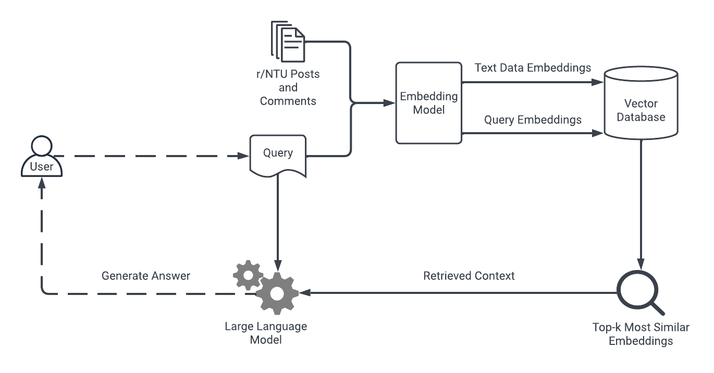

# r/NTU Retrieval-Augmented Generation (RAG) Chatbot
> [!WARNING]
> The LLM may generate hallucinations or misinformation.

## Table of Contents
- [Introduction](#introduction)
- [Tech Stack](#tech-stack)
- [Running the Chatbot](#running-the-chatbot)
- [References](#references)
## Introduction
- This project aims to give users some insight into the daily lives of Nanyang Technological University (NTU) students by indexing their conversations in the NTU subreddit.
- The information is accessible via interaction with a Retrieval-Augmented Generation (RAG) chatbot.
- The database is updated monthly to contain Reddit posts and comments over the past year.
  

## Tech Stack
1. PRAW (Reddit API Wrapper)
2. Sentence Transformers (Embedding Model)
3. FAISS (Vector Database)
4. LangChain (LLM Framework)
5. Zephyr 7B β (LLM)
6. Streamlit (App Framework)
7. GitHub Actions (Data Automation)

## Running the Chatbot
You can test the chatbot [here](https://ntu-reddit-chatbot.streamlit.app/)

## References
[Scraping Reddit using Python](https://www.geeksforgeeks.org/scraping-reddit-using-python/)

[Build a Simple RAG Chatbot with LangChain](https://medium.com/credera-engineering/build-a-simple-rag-chatbot-with-langchain-b96b233e1b2a)

[How to Build a Simple RAG-based LLM Chatbot](https://medium.com/@turna.fardousi/how-to-build-a-simple-rag-llm-chatbot-47f3fcec8c85)

[Building a QA Chatbot with Memory](https://jeevaharan.medium.com/building-a-qa-chatbot-with-memory-using-langchain-faiss-streamlit-and-openai-retrieval-augmented-24384d5f2070)
