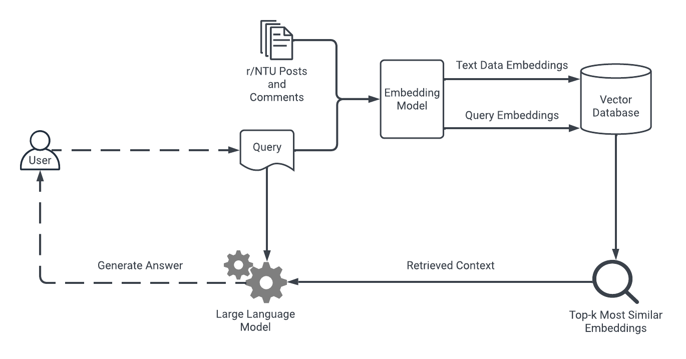

# r/NTU Retrieval-Augmented Generation (RAG) Chatbot
> [!WARNING]
> The LLM can still generate incorrect or incomplete answers. Always verify important information.

## Overview
This project provides a chatbot for exploring student discussions in [r/NTU](https://www.reddit.com/r/NTU/).  
It periodically collects recent subreddit posts/comments, builds searchable vector artifacts, and answers user questions with retrieved Reddit evidence in a Streamlit chat interface.



## Tech Stack
1. `praw` for Reddit API scraping
2. `multi-qa-mpnet-base-dot-v1` for embeddings
3. `faiss-cpu` for vector index artifacts
4. FAISS/NumPy cosine retrieval backend
5. `meta-llama/Meta-Llama-3.1-8B-Instruct` as default chat model
6. Streamlit frontend
7. GitHub Actions monthly data/index refresh

## Data Artifacts
`generate_index.py` produces:
- `data/faiss_index.index`
- `data/faiss_metadata.csv`
- `data/embeddings.npy`

App usage:
- Runtime retrieval backend is selected automatically based on platform.

## Local Setup
Recommended for local macOS runtime stability (Conda, Python 3.11):

```bash
conda create -n reddit-rag-py311 python=3.11 -y
conda activate reddit-rag-py311
pip install -U pip
pip install -r requirements.txt
```

Note:
- GitHub Actions in this repo runs on Python 3.9.
- `requirements.txt` is kept Python 3.9 compatible, but local macOS runs are typically more stable on Python 3.11.

Create `.streamlit/secrets.toml`:

```toml
HUGGINGFACE_API_KEY = "hf_..."
```

You can also use an environment variable:

```bash
export HUGGINGFACE_API_KEY="hf_..."
```

## Build / Refresh Data Locally
1. Update subreddit data:
```bash
python build_df.py
```
2. Rebuild retrieval artifacts:
```bash
python generate_index.py
```
3. Run app:
```bash
streamlit run app.py
```

## GitHub Actions (Optional)
If enabled, `.github/workflows/update_reddit_data.yaml` will:
- run monthly (and manually on dispatch)
- refresh `reddit_data.csv` + index artifacts
- commit and push updated `data/*` files

If you keep this workflow active, local updates are as simple as:
```bash
git pull
```

## Notes
- App shows **Data freshness in Singapore time (SGT)**.
- If `data/faiss_metadata.csv` is missing, the app still runs but source precision is reduced.
